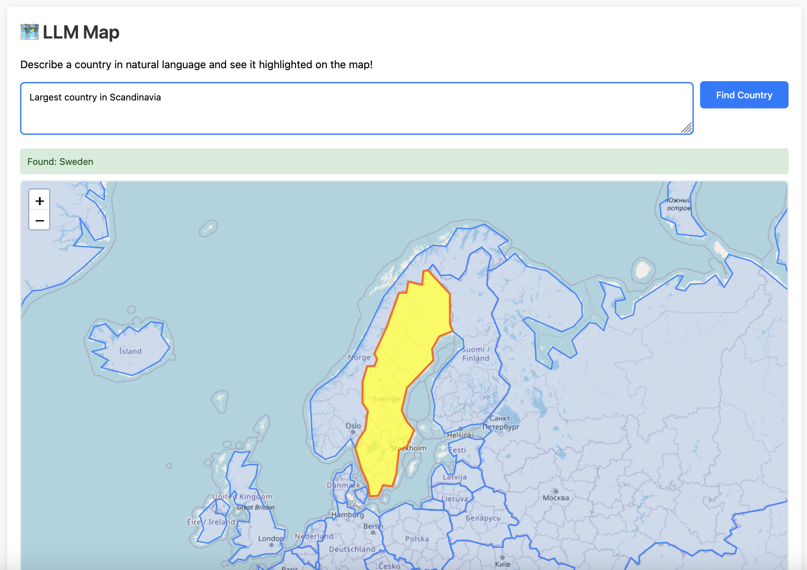

# LLM Map 🗺️

Interactive world map that finds and highlights countries based on natural language descriptions using AI.



## Features

- Describe countries in plain English (e.g., "The country between Canada and Mexico")
- AI-powered country identification using Google's Gemini API
- Interactive map with click-to-select functionality
- Real-time country highlighting

## Quick Start

### Prerequisites
- Python 3.8+
- Google AI API key

### Setup

1. **Clone and install dependencies:**
   ```bash
   git clone https://github.com/thfa/llmmap.git
   cd llmmap-main
   pip install -r requirements.txt
   ```

2. **Set up environment:**
   ```bash
   cp .env.example .env
   # Edit .env and add your GOOGLE_API_KEY
   ```

3. **Run the server:**
   ```bash
   python app.py
   ```

4. **Open the map:**
   - Open `index.html` in your browser
   - Server runs on `http://localhost:5000`

## Usage

Type natural language descriptions like:
- "The largest country in South America"
- "Country that borders both France and Portugal"

Press Enter or click "Find Country" to see results highlighted on the map.

## API

**POST** `/get-country`
```json
{
  "message": "Country description"
}
```

**Response:**
```json
{
  "country_code": "USA",
  "success": true
}
```

## License

MIT